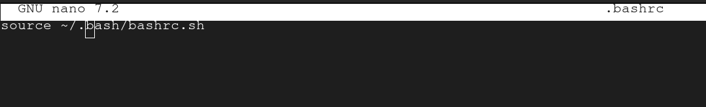
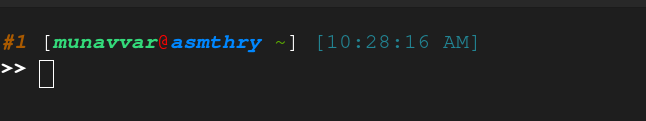

## My bashrc

### Git Support
Copy the ps git helper module to your home directory and include it in your .bashrc/.zshrc file. You can copy any file from these two directories
1) /usr/share/git/completion/git-prompt.sh
2) /usr/share/git/git-prompt.sh
```bash
cp /usr/share/git/completion/git-prompt.sh ~/.git-prompt.sh
```

### Setup
1) Clone this repository into your home directory and rename bash to .bash
```bash
mv ./bash ./.bash
```
2) Remove all lines from your ~/.bashrc or ~/.zshrc file
```bash
cp /dev/null .bashrc
```
3) Include library bash script to your .bashrc or .zshrc file
```bash
nano ~/.bashrc
```

4) Enjoy your new Bash PS look


### GIT Aliases
|Alias|Command|
|-----|-------|
|gin|git init|
|gco|git commit|
|gcom|git commit -m|
|gst|git stash|
|gstp|git stash pop|
|gpu|git push|
|gpl|git pull|
|gplb|git pull origin|
|gpub|git push origin|
|gcoan|git commit --amend --no-edit|
### GIT Flow Aliases
You need to install gitflow or gitflow-avh package for this alias to work.
|Alias|Command|
|-----|-------|
|gf|git flow|
|gffs|git flow init|
|gffs|git flow feature start|
|gfff|git flow feature finish|
|gfhs|git flow hotfix start|
|gfhf|git flow hotfix finish|
|gfrs|git flow release start|
|gfrf|git flow release finish|


### Artisan Aliases
|Alias|Command|
|-----|-------|
|art|php artisan|
|arts|php artisan serve|
|artmamo|php artisan make:model|
|artmaco|php artisan make:controller|
|artmali|php artisan make:livewire|
|artmafa|php artisan make:factory|
|artmase|php artisan make:seeder|
|artmami|php artisan make:migration|
|artmarr|php artisan make:request|
|artma|php artisan make:$1|
|artmi|php artisan migrate|
|artmifr|php artisan migrate:fresh|
|artmire|php artisan migrate:refresh|
|artmirt|php artisan migrate:reset|
|artmirb|php artisan migrate:rollback|
|artmist|php artisan migrate:status|
|artdbs|php artisan db:seed|
|artdbsc|php artisan db:seed --class=$1|
|artte|php artisan tenant:artisan "{$@}"|
