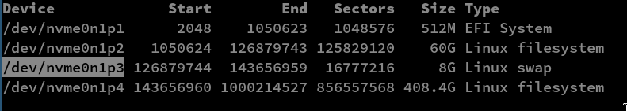
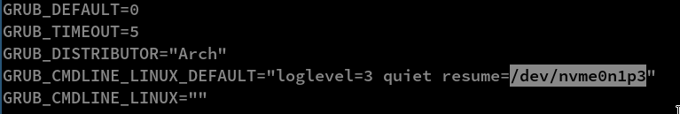
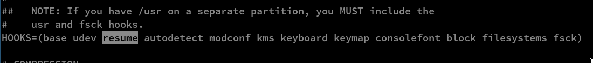

## Hibernate archlinux to swap partition
-----------------------
Hibernate feature is not enabled by default in archlinux, we need to add some things to enable it
### Required packages
```
sudo pacman -S acpid
```
1) Run this command `sudo fdisk -l` to get disk list. Copy the swap partition,here I use /dev/nvme0n1p3

2) Edit __/etc/default/grub__ file and add __*resume=/dev/nvme0n1p3*__ after __'quiet'__ \
__*GRUB_CMDLINE_LINUX_DEFAULT="loglevel=3 quiet resume=/dev/nvme0n1p3"*__

3) Generate grub configuration using this command `sudo grub-mkconfig -o /boot/grub/grub.cfg`
4) Edit __/etc/mkinitcpio.conf__ file and add the __resume__ hook\
__*HOOKS=(base udev resume autodetect modconf kms keyboard keymap consolefont block filesystems fsck)*__

5) Run `sudo mkinitcpio -P` to generate initramfs
6) Use `systemctl hibernate` command to hibernate the system