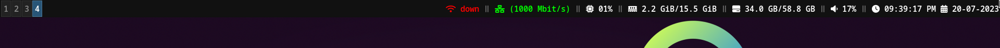

## My i3 configuration
-----------------------
### Required packages
1) __maim__ - To take screenshots
2) __xclip__ - Clipboard support
3) __xdotool__ - To get the details of the active window
4) __feh__ - Set background images
5) __archlinux-wallpaper__ - Get some awesome wallpapers
6) __playerctl__ - Control media player
7) __ttf-font-awesome__ - Support for font awesome icons
```
sudo pacman -S xclip xdotool maim feh archlinux-wallpaper playerctl ttf-font-awesome
```

|Shortcut|Action|
|--------|------|
|Super + Shift + End|Power off the system|
|Super + Shift + Delete|Reboot the system|
|Super + Shift + BackSpace|Hibernate the system|
|Super + q|Kill focused window|
|Print |Take full screenshot|
|Ctrl + Print|Take a screenshot of the active window|
|Shift + Print|Take a screenshot of the selected part|
|Super + Print|Take full screenshot to clipboard|
|Super + Ctrl + Print |Take a screenshot of the active window to the clipboard|
|Super + Shift + Print|Take a screenshot of the active window to the clipboard|
|Super + KP_Add |Increase Volume 2% |
|Super + KP_Subtract|Decrease Volume 2% |
|Super + KP_Multiply|Mute/Unmute speaker|
|Super + KP_Divide|Mute/Unmute mic |
|Super + Ctrl + Right |Play next music
|Super + Ctrl + Left|Play previous music
|Super + Ctrl + p |Play/Pause music
|Super + Ctrl + Up|Seek 5 seconds forward
|Super + Ctrl + Down|Seek 5 seconds backward

